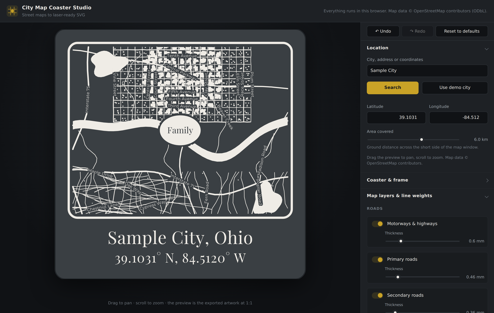

# City Map Coaster Studio

A browser tool for designing street-map coasters and exporting them as
millimetre-accurate SVG for a laser — xTool Creative Space, LightBurn, LaserGRBL,
Glowforge, or anything else that reads SVG.

Type in a city or an address, tune what gets engraved, and download a file that
is already the right physical size.



## Running it

No build step, no bundler, no install:

```bash
node server.js          # → http://localhost:5173
```

Any static server works (`python3 -m http.server`, `npx serve`, …), but it does
have to be a server — opening `index.html` from the filesystem breaks ES modules
and `fetch`.

Everything runs in the browser. Nothing is uploaded anywhere, and your design is
kept in `localStorage` so it survives a reload.

## What it does

**Location.** Search any city, address or landmark, or paste `39.9943, -76.7298`
straight into the box. Drag the preview to pan and scroll to zoom; map data is
refetched only when you leave the area already downloaded, and anything
downloaded before is reused from a local cache.

**Layers.** Motorways, primary/secondary/minor roads, residential streets,
service roads, footpaths, railways, rivers, streams and canals, lakes and bays,
parks and woodland, and buildings — each one toggled independently with its own
thickness in millimetres. Area layers (water, parks, buildings) draw either as
solid shapes or as outlines.

**Frame.** Square, rounded-square or round coasters at any size, with a border of
adjustable thickness and corner radius. **Map only** puts the frame around the
map with the caption below it; **Map + caption** runs it around the coaster
perimeter with the place name inside, as on the reference coaster. There is an
optional cut line on its own layer.

**Caption.** Any number of lines under the map, each with its own font, weight,
italic, size, letter-spacing, line-spacing, capitalisation, alignment and
sideways nudge. One **overall caption size** slider scales the whole block at
once, and the panel reports how many millimetres it is reserving — shrink it and
the map grows into the space. Drag the caption in the preview to move it, or
nudge it with the sliders. Searching a place rewrites the place name and
coordinates for you, and panning keeps the coordinates in step until you edit the
text yourself.

**Pin.** Seven marker shapes — disc, oval, pill, heart, teardrop map pin, ring
and plain dot — centred on the map or dropped anywhere by clicking. Put `Home`,
`Family` or anything else inside, knocked out of the shape so the letters stay
unengraved. The oval and pill stretch to fit the word; the round shapes grow as a
whole, so "Pin size" is a floor rather than a hard limit and a long word never
spills over the edge. Switching the pin on always puts it somewhere visible: if
its saved coordinates are outside the current view, it is moved to the middle
rather than drawn off the coaster.

**Undo.** Undo and redo sit at the top of the panel and answer to Ctrl/Cmd+Z and
Ctrl/Cmd+Shift+Z. History works in gestures, so dragging a slider is one step
rather than forty. **Reset to defaults** is undoable too.

**Labels.** Optional street, park and water names, rotated to follow the road
they name, with collision avoidance and a cap on how many appear.

## Getting a good burn

The exported file is built for laser software specifically, not just "an SVG that
happens to look right":

- **Filled shapes, not strokes.** This is the one that bites hardest. xTool
  Creative Space imports an SVG as paths and throws `stroke-width` away, so a
  0.6 mm road arrives as a hairline and a stroked frame arrives as nothing worth
  engraving. Every line here is therefore expanded into a closed shape of the
  right width before export — the file contains no `stroke`, no `stroke-width`
  and no `fill="none"` at all, so there is nothing left for an importer to
  discard. (**Line geometry → Centre lines** turns this off for LightBurn line
  mode, which does honour stroke widths and makes a smaller file.)
- **Real millimetres.** The root element carries `width="100mm" height="100mm"`
  alongside a matching `viewBox`, so the artwork imports at 1:1 with no scaling
  step to get wrong.
- **No clip paths.** Geometry is clipped mathematically to the map window before
  it is written out. Laser software either ignores `clipPath` or engraves what it
  hides; here there is nothing hidden to get wrong.
- **No live text.** Every glyph — caption, pin and labels alike — is converted to
  outlines. Your machine does not need the font, and it cannot substitute one.
- **No transforms.** Rotations are baked into the coordinates, so importers that
  drop `transform` attributes cannot stack every rotated label at the origin.
- **Genuine clear space.** The pin and each label do not merely sit *on top of*
  the streets — the streets underneath are actually removed, so knocked-out
  letters read as bare slate instead of filling in with whatever ran beneath.
- **No phantom lines.** Clipping a lake or a wood at the edge of the map can
  leave geometry that is not really there: a hairline strip a few hundredths of
  a millimetre thick, or a degenerate "bridge" streaking across the map when the
  visible part of a concave shape falls into two pieces. Both are removed before
  anything is drawn, so the file contains only features the map actually has.
- **Named layers.** Each layer is its own `<g>` with an id and an Inkscape layer
  label, which LightBurn and Inkscape both pick up.
- **Optional colour coding.** "Colour per layer" gives every layer a distinct
  stroke colour so xTool and LightBurn can assign separate power and speed per
  layer. "One colour" keeps the whole thing as a single operation.

### Importing into xTool Creative Space

1. Add → Import Image/File, pick the SVG. It arrives at its true size; do not
   scale it.
2. Select it and set the processing type to **Engrave** (fill), not Score or
   Cut. XCS defaults imported vectors to outline processing, which draws every
   shape as a hairline outline — including the frame and the caption letters.
   Engrave fills them, which is what makes the line weights you chose appear.
3. Slate takes a light touch — start around 60–70% power at high speed and test
   on an offcut.
4. If you exported with **Colour per layer**, XCS splits the file into one object
   per colour; select each and set its own parameters. Solid buildings and water
   usually want more power than fine streets.
5. If you enabled the cut line, move that layer to **Cut** (or **Score**) — it is
   the only red `#ff0000` path in the file, and the only one exported as a
   centre line, because a cut follows a path rather than filling a shape.

If the artwork still comes in as hairline outlines, the object is set to Score or
Cut rather than Engrave — step 2. Nothing in the file depends on stroke widths,
so there is no export setting that can cause it.

### Importing into LightBurn

The layer groups come through as named layers. Assign each a colour layer, set
Fill for the solid shapes and Line for the strokes, and the whole coaster runs as
one job.

### Sizing notes

Slate coasters sold as "4 inch" are usually 100 mm; the presets cover 95 mm,
100 mm and a true 101.6 mm. Leave the default 5 mm edge margin — slate coasters
have irregular chipped edges, and artwork that runs closer than about 4 mm tends
to fall off the usable face.

Streets thinner than about 0.15 mm tend to disappear on slate. If a design comes
out too faint, raise **Overall line weight** rather than editing every layer.

## When the download is slow

OpenStreetMap's public Overpass servers are free, shared and frequently busy,
and they are by far the slowest part of the app. Several things are done to keep
that from being your problem:

- **Streets first.** Streets and water are requested separately from buildings,
  so the map draws as soon as the cheap half arrives rather than waiting for the
  expensive half.
- **A second server is started early.** If the first mirror has not answered
  within a few seconds, the next one is asked in parallel and whichever replies
  first wins. A mirror that returns "busy" is abandoned immediately.
- **Every attempt has a deadline.** A server that accepts the connection and
  then goes quiet used to leave the app waiting for ever; now it gives up and
  says so.
- **Only what is needed is asked for.** The query fetches coordinates inline
  rather than making the server collect and return every node id separately
  (about a third less to download and no second pass on the server), and the
  margin fetched around the visible window is modest rather than generous —
  together roughly half the bytes of a naive query.
- **Houses are skipped when they cannot be engraved.** Above about 2.7 km
  across, a typical house footprint is finer than the laser resolves and would
  be filtered out after downloading it. Past that point houses, garages and
  sheds are left out of the query — in a suburb that is most of the payload.
  Larger buildings still come through, and the status line says when this
  happens. Lowering **Smallest building kept** to zero turns it off.
- **Nothing is downloaded twice.** Map data is cached in the browser, so
  reopening a design, panning back, or toggling a layer off and on is instant.
  **Clear map cache** in the export section forces a fresh download.

If you run your own Overpass instance, `?overpass=https://your-server/api/interpreter`
on the app's URL sends every query there instead of the public mirrors.

Still slow? Reduce **Area covered**, or turn buildings off — they are the
largest part of any request by a wide margin.

## Working offline

**Use demo city** loads a synthetic town bundled with the app, so you can explore
every control — and check the export pipeline — with no network at all. It is
generated data, not a real place; regenerate it with `npm run fixture`.

## Tests

```bash
npm test              # geometry, typography, pipeline, plus a browser pass
npm test -- --no-browser
```

The suite checks the projection round-trips, that clipping and knockout
subtraction remove exactly the right area, that multipolygon lakes keep their
islands, that no geometry escapes the map window, that nothing survives under the
pin, that every marker shape's knockout really covers the shape drawn on top of
it, that stroke expansion reproduces the widths it replaces, and — sweeping the
demo city at five zoom levels — that clipping leaves behind neither hairline
fills nor degenerate bridges. The export is checked to contain no stroke
attributes whatsoever, and the two geometry modes are rendered in a real browser
and compared pixel by pixel. The fetching tests run a mock Overpass server and
check that a stalled mirror is overtaken, a busy one fails over at once, a total
stall ends in an error rather than a hang, and a repeat view makes no request at
all. The browser pass boots the app, cycles through all seven marker shapes,
drags the caption, undoes and redoes, resets, shrinks the caption and checks the
map grows, strands the pin in another city and checks switching it on brings it
back, searches a stubbed place and checks the caption filled itself, then exports
an SVG and confirms it restores after a reload.

`node tools/render-fixture.mjs out.svg --preset labels` renders the demo city
headlessly, which is handy when changing the geometry pipeline.

`node tools/mock-overpass.mjs 5300` stands in for the Overpass API, and can be
told to stall, report itself busy or answer slowly. The fetching tests drive it
to check the failover behaviour; you can also point the app at it with
`?overpass=http://localhost:5300/api/interpreter`.

## How it fits together

| File | Job |
| --- | --- |
| `src/geo.js` | Web-Mercator projection, lon/lat ↔ millimetres |
| `src/clip.js` | Convex clipping, artefact cleanup, and the subtraction that makes clear space |
| `src/stroke.js` | Expands centre lines into closed filled outlines |
| `src/simplify.js` | Douglas–Peucker thinning in millimetre space |
| `src/overpass.js` | Query assembly, hedged mirror racing and per-attempt deadlines |
| `src/cache.js` | IndexedDB cache of downloaded map data |
| `src/geocode.js` | Nominatim with a Photon fallback |
| `src/osm.js` | Overpass JSON → features, including multipolygon stitching |
| `src/layers.js` | Tag → layer taxonomy, defaults, paint order |
| `src/layout.js` | Where the map, border and caption sit on the coaster |
| `src/prepare.js` | Project, thin, clip and group geometry per layer |
| `src/labels.js` | Label selection, placement and collision avoidance |
| `src/pinshapes.js` | Marker outlines and their convex decompositions |
| `src/paths.js` | Shared rounded-rect and ellipse path builders |
| `src/knockouts.js` | The shapes punched out for the pin and labels |
| `src/typography.js` | Font loading and text-to-outline conversion |
| `src/render.js` | Builds the SVG for both preview and export |
| `src/state.js` | The design object, store and persistence |
| `src/ui.js`, `src/controls.js` | The control panel |
| `src/main.js` | Wiring, data fetching, pan/zoom/click |

## Credits and licensing

- Map data © [OpenStreetMap](https://www.openstreetmap.org/copyright)
  contributors, available under the Open Database Licence (ODbL). Anything you
  publish or sell that is derived from it needs to carry that attribution — the
  exported SVG includes it in its `<desc>`.
- Geocoding by [Nominatim](https://nominatim.org) and
  [Photon](https://photon.komoot.io). Both are free community services; the
  usage policies ask for reasonable request rates, which is why search here is
  manual rather than type-ahead.
- [opentype.js](https://opentype.js.org) (MIT) does the text-to-outline work.
- Bundled fonts are SIL Open Font License 1.1 — see `assets/fonts/README.md`.
- This app's own code is MIT licensed.
